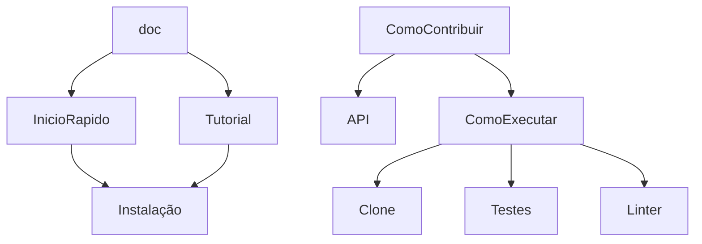

# Documentação!

## Resumo / Página Inicial / Readme (repo)
### Cards
- Cards para levar para lugares específicos da documentação
    - Início rápido
    - Tutorial
    - Contribuição

### Inicio Rápido
- Contexto sobre a aplicação
    - sub-comandos do CLI
- Como instalar
    - pip install ...
- Como executar
    - Gancho com o contexto e uma explicação básica de cada comando
    - Help
## Tutorial
- Detalhar os objetivos
- Instalação!
    - pip install ...
- Explicar cada sub-comando
    - Variações dos comando
    - Aproveitar os recursos gráficos
        - imagens e vídeos
    - Problemas comuns! [???]

## Quero contribuir
- Como executar o projeto
- Como rodar os testes
- Como rodar os linters
- Descrição dos módulos
    - Aponta para a documentação da API

- Dicas de contribuição (com referências)
    - Implementar escalas
        - wikipedia das escalas
    - Classes customizadas de Erros
        - NotaErro
    - Progressões harmonicas
    - Implementação de triades
        - sus4
        - sus9
    - Tétrade
        - Acordes com 7
        - Acordes com 9
    - Funções harmonicas
        - Tonica
        - dominante
        - sub-dominante
        - relativos

 ## API
 - Explicar os módulos       

 ---
 ## Parte técnica

 - Macros: Não repita comandos que podem se modificar
 - Templates: Para que blocos de documentação repetidos não sejam duplicados em vários lugares.
 - Cards: Html e CSS para os cards